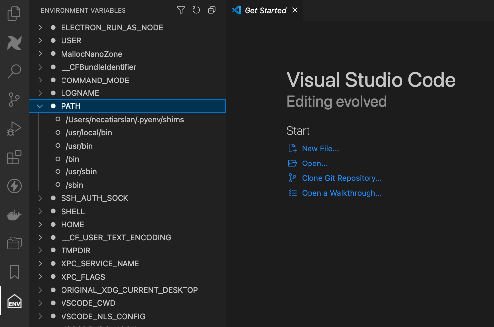

# Environment Variables

Easly browse your system environment variables within vscode.

## Todo List
- Copy
- Add/Remove Fav
- Add,Update,Delete
- Export / Import

Thanks, \
Necati ARSLAN \
necatia@gmail.com